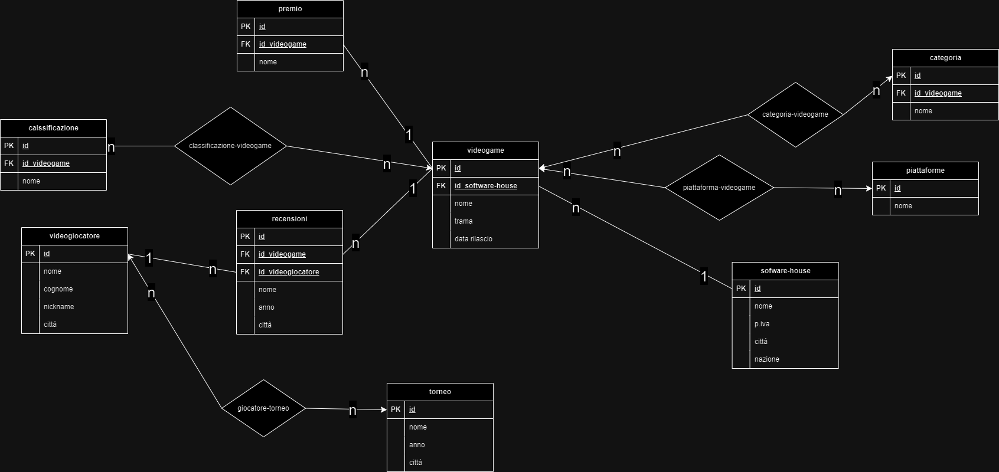

<h1 align="center">
  
 express-gestore-eventi
  
</h1>

<!-- <h4 align="center">summary <a href="http://electron.atom.io" target="_blank">"link"</a>.</h4> -->

<!-- <p align="center">
  <a href="https://badge.fury.io/js/electron-markdownify">
    
  </a>
  <a href="https://gitter.im/amitmerchant1990/electron-markdownify"></a>
  <a href="https://saythanks.io/to/bullredeyes@gmail.com">
      
  </a>
  <a href="https://www.paypal.me/AmitMerchant">
    
  </a>
</p> -->

<p align="center">
  <a href="#description">Description</a> •
  <a href="#how-to-use">How To Use</a> •
  <a href="#used-technologies">Used technologies</a> 
</p>



## Description

Creare lo schema e-r con tutte le entità necessarie a gestire le informazioni di un archivio di E-sports. (https://www.drawio.com/)

Ciascun videogame ha:

- nome
- trama
- data di rilascio

ed è prodotto da una software house, la quale, a sua volta, è identificata da:

- nome
- partita iva
- città
- nazione.

I videogames possono essere disponibili su diverse piattaforme (PlayStation 4, PlayStation 5, XBox One, XBox Serie X, Windows, Nintendo Switch, Google Stadia, ...) e hanno

diverse categorie (avventura, strategia, RPG, sparatutto, calcio, ...) e classificazioni PEGI (PEGI 7, PEGI 12, PEGI 18, Violenza, Paura, Gioco d'azzardo, ...)

Periodicamente, vengono organizzati dei tornei a cui possono partecipare tutti i videogiocatori del mondo.
Ogni torneo è caratterizzato

- nome
- l'anno
- la città in cui si svolge.

I giocatori, al momento dell'iscrizione, devono fornire

- nome
- cognome
- nickname di gioco
- città di provenienza.

I videogames possono essere recensiti dai giocatori, i quali oltre al titolo e al testo, possono valutare i videogame con un rating da 1 a 5.

Ogni anno vengono votati i migliori videogiochi, che possono così vincere diversi premi (gioco dell'anno, miglior narrativa, miglior colonna sonora, miglior gioco indipendente, gioco più atteso, ...)

## How To Use

To clone and run this application, you'll need [Git](https://git-scm.com) and [Node.js](https://nodejs.org/en/download/) (which comes with [npm](http://npmjs.com)) installed on your computer. From your command line:

```bash
# Clone this repository
 git clone ('link of the repository')

# Go into the repository
 cd ('file name')

# Install dependencies
 npm install

# Run the app
 npm run dev
```

## Used technologies

This software uses the following technologies:

- [Node.js](https://)
- [Express](https://)

> GitHub [@JohnQuimson](https://github.com/JohnQuimson) &nbsp;&middot;&nbsp;
> Twitter [@John Henric Quimson](https://www.linkedin.com/in/john-henric-quimson-973827280/)
